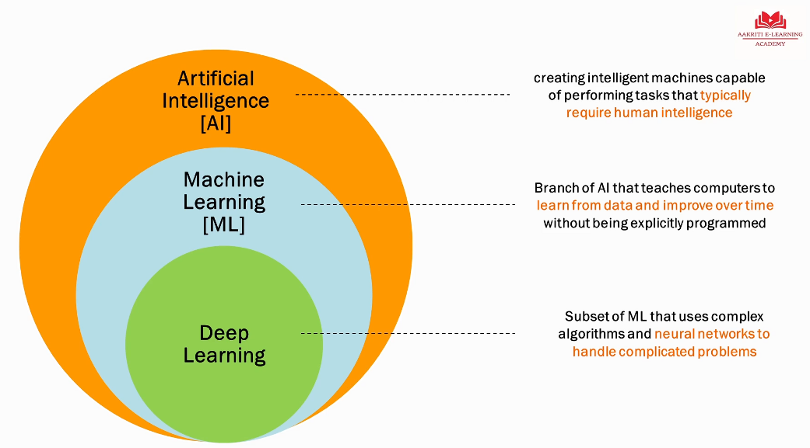
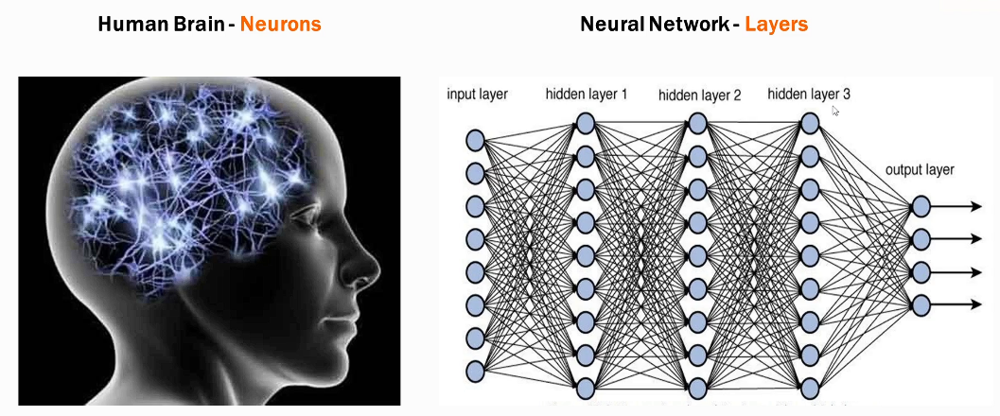
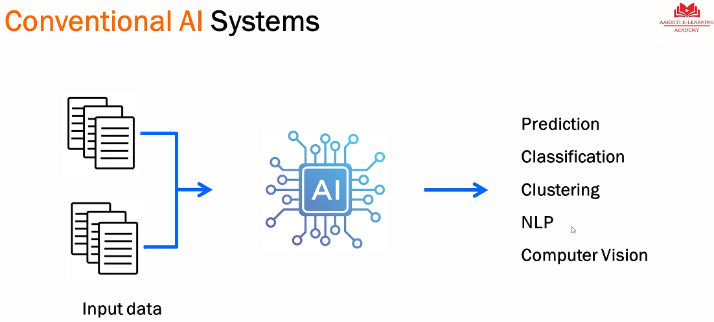
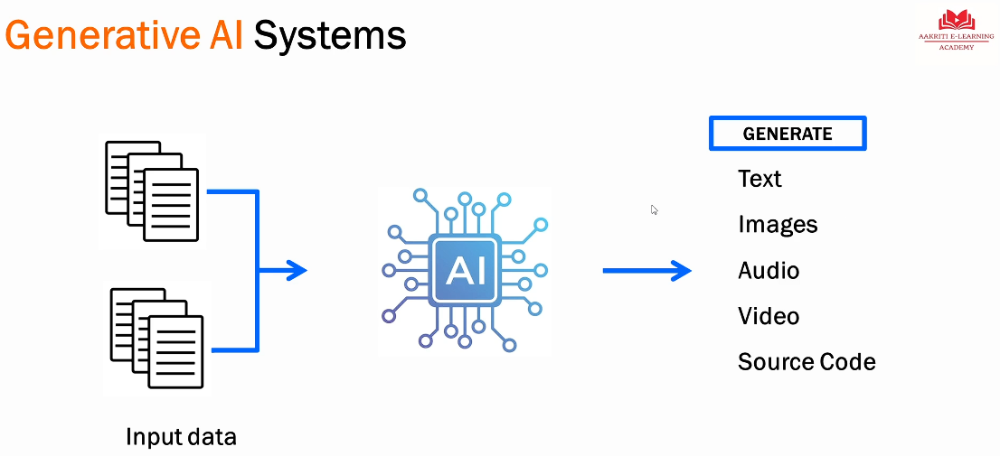

# Module 1 Understanding Generative AI (GenAI)

## Lesson 3

**Generative Artificial Intelligence** (Gen AI) is a type of AI that can create content such as audio, images, text, code, etc. Generative AI is _new_ content. It is not extracted directly/word-for word from a repositiory, a form, etc.

## Lesson 4

**Artificial Intelligence** is a broad field of computer science that focuses on creating intelligent systems capable of performing tasks that typically required human intelligence. (A machine that does human thinking.)

How can a machine think like a human => machine learning.

**Machine Learning** (ML) is a subset of AI that focuses on the development of algorithms and models that can enable computers to learn and make predictions or decisions without explicit programming by humans. 

ML = Substantial Training Data + Computational Power + Algorithms.

ML occurs the same way humans learn. A child learns what an apple is by remembering its attributes (red, round, size, etc). ML occurs the same way but must be exposed to lots of _training data_ (millions of images of apples, different shapes, sizes, colors, etc.). The _computational power_ is needed because massive amount of data to process, computations and optimizations to be done. Because GPUs (graphic processing unit) are now widely available, more powerful, and inexpensive, AI is no longer limited as it was previously. Algorithm processes the data and learns from it.

**Deep Learning** is a subset of machine learning that focuses on teaching computers to learn and make decisions by processing data through neural networks inspeired by the human brain.

The neural network of deep learning uses many layers to process data to generate complicated output such as text and images. Required lots of computational power but gives much better results espcially with more complex tasks.

## Lesson 5 Generative AI - Recap

Conventional AI

> [!Note]
> NLP is Natural Language Processing, a subfield of computer science and artificial intelligence (AI) that focuses on the interaction between computers and human language. It enables machines to understand, interpret, and generate human language in a way that is both meaningful and useful.

Generative AI is a subset of Deep Learning. The amount of training data for generative AI is much greater it is for conventional AI.

If the training data is millions of pictures of apples and you ask GenAI to create an image of an apple, it will create a new image of an apple based on what it has learned. It will not use an existing image of an apple. Generative AI is generating content using artifical intelligence.

### Key takeaways

1. Machines need to be trained on a large volume of good varied data. Lots of different types of apple pictures that are of good quality. Remember - garbage in, garbage out.
2. Need high computational power to process data in a short amount of time.
3. Shift to conversational, contextual understanding.

   **You**: What is the capital of India? 

   **AI**: New Delhi

   **You**: What is the weather there?

   **AI**: Responds with weather info for New Delhi, understanding that when you said "there" you meant New Delhi.

## Lesson 6 Explore ChatGPT

[ChatGPT](https://chatgpt.com/) is a large language model (LLM) developed by OpenAI; designed for natural language understanding and generation, specifically in a conversational context as in the previous New Delhi example.

* Generative AI app
* Trained on billions of documents
* Based on Generative Pre-Trained Transformer (GPT), a type of neural network
* Offers a web interface for end-users and APIs for developers

> [!Note]
> ChatGPT 4 also incoporates DALL-E for images.

LLaMA is Meta's family of LLMs. Gemini (formerly Bard) is Google's chatbot.

