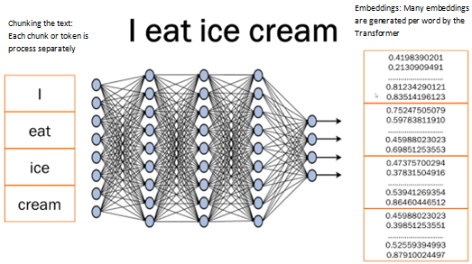
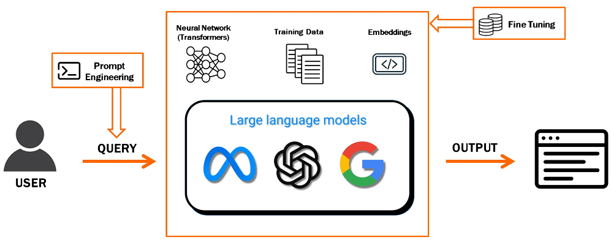

# Module 2 Understanding key terminologies

## Lesson 8 Large Language Model (LLM)

Powerful artificial intelligence models designed for understanding and generating human-like text. Like the predictive text when you are texting but on a grander scale.

Basically LLM means text. Gen AI and LLM cannot be used interchangebley because AI includes text, images, audio, code, and more.

LLM uses Transformers, a type of neural network. It knows , words, language, grammar, context, etc.

Output for Transformers is (predicting) one word at a time.

### Key points

1. Pre-training: Trained on huge corpus (collection of written text) of data.
2. Size and scale: Massive neural networks with numerous parameters. Chat GPT 3.0 was trained on 1.75 billion parameters.
3. Fine-tuning: More targeted data set/training for specific tasks, such as answering questions about a specific things (healthcare, automotive repair, nutrition, whatever)

### Use cases (short list)

1. Content generation: Advertising, marketing, sales
2. Chatbots and virtual assistants: User support, other interactions. This is huge => company's doc will be used by chatbot to answer questions at the first level of engagement. Passed to human if question is not answered.
3. Language translation
4. Text summarization: reduce lengthy content to specification such as short summary, long summary, etc.
5. Q&A: Answer questions, provide info

## Lesson 9 Prompt Engineering

**Prompt** is a specific question, command, or input that you provide to an AI system to request a particular response, information, or action. 

**Prompt Engineering** is the process of crafting well-defined and structured input queries to interact with AI systems in order to get accurate and relevant responses.

### Examples of prompts:

* Text generation: Summarize the key points of this research article and its impact on the tuna industry
* Image generation: Generate an art-deco style image of a frog in a Bruins hockey jersey
* Creative writing: Write a short story about a detective losing his cell phone while trying to solve a case about missing shoes.
* Code generation: Write a Python program to input two numbers and calculate their sum.

Also:
* Alexa: How's the weather today?
* Siri: Will it rain today?
* Google: Red velvet cake recipe

### Quality of prompts
Be specific to your use case, provide context so that you get a better answer. Changing one word can change the response. Prompt can be large - 50 lines of text explaining to the paramters (my word) of the desired response.

'What is AI?' _versus_ 'I'm a healthcare professional. Explain to me what AI is and how it is used in my field.'  

AI will remember the conditions and context as you continue to use it. 

If you specify this info:

Imagine you are a journalist doing short summarized reports on lupus. When I ask you a question, give me answers in less than 500 words. The answers should be bulleted.

You can ask questions such as:

* What is lupus?
* What are the signs and symptoms of lupus?
* What are the diagnostics tests for lupus?
* What are the causes of lupus?
* What is the treatment for lupus?

You can build on your questions. For example, after you get an answer to the causes of lupus, you can prompt 'Give me the same information about Raynaud's condition' and it will respond with the causes of Raynaud's condition.

### Best practices for Prompt Engineering

1. Clearly convey the desired response such as short summary, bulleted answers, etc.
2. Provide context or background info so the answers are pointed, i.e, I'm a healthcare professional, on Saturday, in Colorado, etc.
3. Balance simplicity and complexity. Note that if the prompt is too complex, the response might be garbage.
4. Iterative testing and refinement. You probably will not get the desired response with the first prompt. You might have to try several prompts to get the response that works best for your use case. Prompt engineering is an art. You have to be clear <u>and</u> creative.

## Lesson 10 Embeddings

Machines do not understand text; they only understand numbers. Embeddings are numerical representations of text. They are essential for AI models to understand and use human language effectively.

Embeddings need to convey the meaning of the word, the context, the relationship to other words, etc. so it can differentiate between sentences like _Ice cream tastes great_ and _I dropped my ice cream, great_. _Great_ is positive in the first sentence but sarcastic in the second sentence.  

The meaning, context, etc. of the embeddings is only know to the Transformer that created them. Because of embeddings, AI can predict that the next word in the sentence below is probably _cream_.

    They went to the mall to eat ice 

## Fine Tuning

Fine tuning a LLM is the process of adapting a pre-trained foundation model to perform more specific tasks to cater to a particular domain more effectively.

The pre-trained LLMs are generic. You have to fine tune them for use with your specific data set.

### Fine tuning methods
1. Self-supervised

     Give the LLM your domain specific training data. This is similar to how the foundation model is trained. 

2. Supervised

    Give the LLM training data that is labeled as input and output. For example, input = How do I find a broken bone? Output = Do an xray.

3. Reinforcement

   Old model where the output is scored.

    * I _drink_ ice cream. = 0
    * I _eat_ ice cream. = 10

### Fine tuning is <u>not</u> about:

* Creating intelligence from scratch. You are using a foundation model that is already trained on a large data set.

* Eliminating data requirement.

* A single universal solution: implementation is based on your use case.

* Magical one-time process. There will be multiple cycles of fine-tuning.

## Lesson 12 Recap

