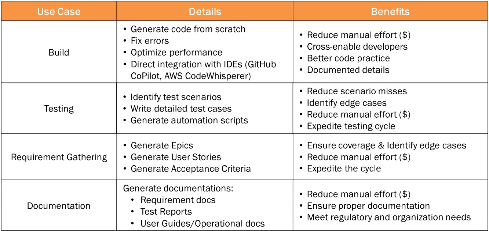
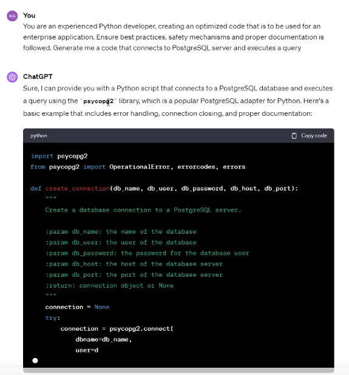
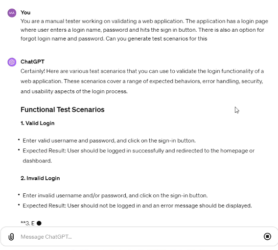
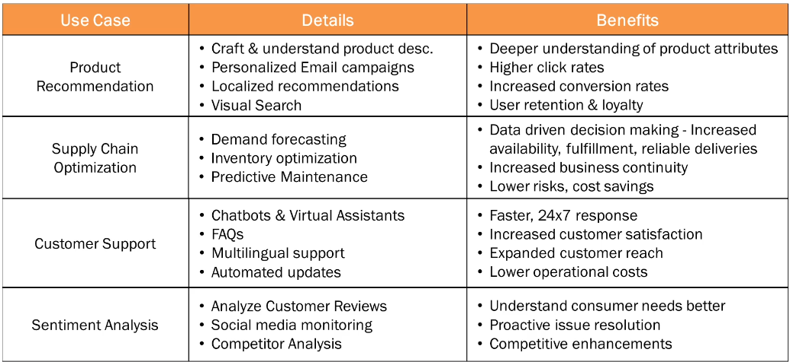
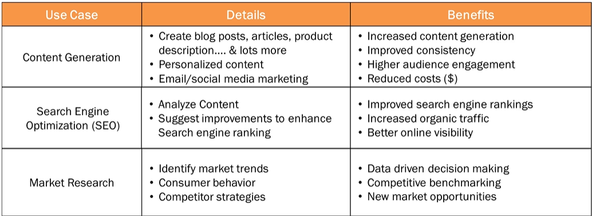
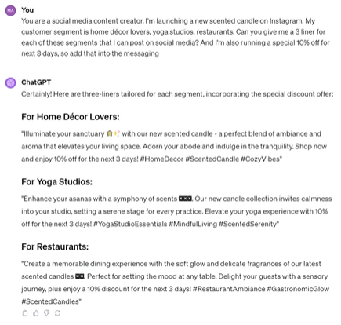

# Module 3 Generative AI Use Cases Across Industries

## Lesson 14 Software Development

Common core activities such as a build, test, requirement gathering phases, etc. with deliverables that can benefit from the use of GenAI. The GenAI response might not be the final product but it is a good place to start.

Many software development applications have built-in AI (example, GitHub and VS uses Copilot). If you use GenAI for software, you can keep your data anonymous. Your code would not be shared or used for training the model. If you use ChatGPT or similar public AI, it will be used to train the model. Ensure that you don't share any sensitive or proprietary info.

### Building

Example of a prompt to create code:

### Testing

Example of a prompt to test an application login process; it creates functional and security test cases:

## Lesson 15 Retail

Example: If someone wrote a long product review, you can paste it in ChatGPT and ask for a short summarization of the key points. Further, you could provide access to all product reviews and then ask AI for the top pros/cons of the product.

## Lesson 16 Marketing

As of September 2023, about half of the marketing industry reported using AI.

