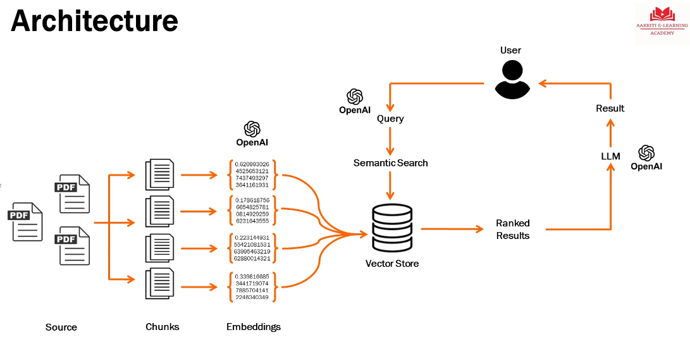
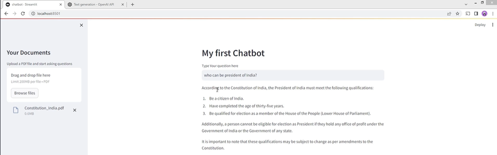

# Module 4 Building a GenAI Chatbot

## Lesson 19 Setting up the environment and keys

Objective is to create a chatbot that uses our personal documents and provides Q&A abilities.

Take a general model and fine tune it to our documents.



* **Source**: KB articles
* **Query**: Uses the OpenAI algorithm to convert the query (words) to query (numbers).
* **Semantic Search**: Will get the closest matches between the query (numbers) and the contents of the vector store (respository of embeddings).
* **Vector Store**: Database that stores embeddings
* **Ranked Results**: Matches from the semantic search are ranked so you get the best answer first. The results are passed to the LLM where OpenAI converts the embeddings to words

## Lesson 20-22 Creating the Chatbot

Build a chatbot that _creates_ answers based on information that was extracted from a specific pdf, not the internet.

See the [videos](https://www.udemy.com/course/generative-ai-for-beginners-b/learn/lecture/40913804#overview) and [code file](./assets/Chatbot+Code.txt) in its entirety.

To create the chatbot, elements from Langchain are used. Lanchain is a software framework that helps facilitate the integration of LLMs into applications.

### Lesson 20 Extract text and create chunks
After you upload and extract the text, you determine the size of the chunks by specifying the number of characters in the chunks (example 1000). You can also specify a chunk overlap (150 characters) so that the previous chunk includes the first 150 characters of the subsequently chunk so that context/meanings aren't lost. 

FAISS (Facebook AI Similarity Search) is a library that allows developers to quickly search for embeddings of multimedia documents that are similar to each other. It solves limitations of traditional query search engines that are optimized for hash-based searches, and provides more scalable similarity search functions.

```
#Upload PDF files
st.header("My first Chatbot")

with  st.sidebar:
    st.title("Your Documents")
    file = st.file_uploader(" Upload a PDf file and start asking questions", type="pdf")

#Extract the text
if file is not None:
    pdf_reader = PdfReader(file)
    text = ""
    for page in pdf_reader.pages:
        text += page.extract_text()
        #st.write(text)

    #Break it into chunks
        text_splitter = RecursiveCharacterTextSplitter(
            separators="\n",
            chunk_size=1000,
            chunk_overlap=150,
            length_function=len
        )
        chunks = text_splitter.split_text(text)
        #st.write(chunks)    
```

### Lesson 21 Generate embedding and create storage

You must first generate the embeddings via OpenAI. Then when you create the vector store the FAISS db is initialized, and the chunks and embeddings are stored in the db. It only requires two lines of code because you are using existing AI models and you fine tune them by specifying parameters for your data (previous lesson).

```
# generating embedding
    embeddings = OpenAIEmbeddings(openai_api_key=OPENAI_API_KEY)

# creating vector store - FAISS
    vector_store = FAISS.from_texts(chunks, embeddings)
```

## Lesson 22 Query, search, and output

### Add query box to UI

> [!Note]
> The _temperature_ parameter controls the randomness of the generated text. Lower values (0 or 0.2) result in predictable and repetitive output. Higher values (0.8 or 2, for example) result in creative or random repsonses. As with most parameters, the correct value depends on your use case.

```
# get user question | create input field
    user_question = st.text_input("Type Your question here")

    # do similarity search between query and vector store
    if user_question:
        match = vector_store.similarity_search(user_question)
        #st.write(match)

        #define the LLM
        llm = ChatOpenAI(
            openai_api_key = OPENAI_API_KEY,
            temperature = 0,
            max_tokens = 1000,
            model_name = "gpt-3.5-turbo"
        )

        #output results
        #chain -> take the question, get relevant document, pass it to the LLM, generate the output
        chain = load_qa_chain(llm, chain_type="stuff")
        response = chain.run(input_documents = match, question = user_question)
        st.write(response)
```



